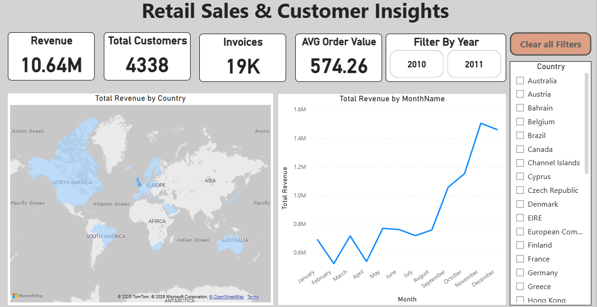

# Retail Sales & Customer Insights Dashboard
This project analyzes retail transaction data to uncover sales trends, geographic performance, and product-level insights. Python was used for data cleaning, transformation, and feature engineering, while Power BI was used to build interactive dashboards for business decision-making.
The dashboard focuses on executive sales overview and product performance analysis, enabling stakeholders to quickly understand revenue trends, top-performing products, and country-wise sales distribution.

## 🔧 Tools & Technologies
•	Python (Pandas, NumPy, Matplotlib) – data cleaning & preparation
•	Power BI – interactive dashboards & business insights

## 📊 Dashboard Pages

### 1️⃣ Sales Overview
provide a quick overview of revenue, cusotmers, and orders along with trends overtime of revenue and the geographical locations.

### 2️⃣ Product Performance
Highlights monthly revenue patterns, top revenue-generating products, and the relationship between sales quantity and revenue.

### 3️⃣ Top 10 Countries by Revenue
Shows the leading countries contributing to total revenue, supporting market comparison and regional analysis.

### 📌 Key Insights
•	Clear seasonality patterns in monthly revenue
•	Revenue concentration among a limited set of products
•	Strong geographic dependence on top-performing countries

## Date Source
original Dataset: https://archive.ics.uci.edu/dataset/352/online+retail
Cleaned Dataset: https://drive.google.com/drive/folders/1yINGcz1CnID6GEBvmCRXkzPm9PPkqN3z?usp=sharing
